# 符号执行计划 (SEP) - YT-DLP GUI 下载器

**生成时间**: 2026-02-01 09:49:45
**方案选择**: Python + CustomTkinter (方案1)
**审计评分**: A=9/10, B=9/10 ✅

---

## 📊 架构逻辑图

```mermaid
graph TD
    subgraph "用户界面层 (GUI)"
        A[main.py<br/>程序入口] --> B[app.py<br/>主窗口]
        B --> C[url_input<br/>URL输入框]
        B --> D[queue_view<br/>下载队列列表]
        B --> E[settings_dialog<br/>设置弹窗]
    end
    
    subgraph "核心逻辑层 (Core)"
        F[config.py<br/>配置管理] --> G[config.json]
        H[task.py<br/>任务状态模型]
        I[downloader.py<br/>下载器封装]
        J[queue_manager.py<br/>队列调度器]
    end
    
    subgraph "外部依赖"
        K[yt-dlp<br/>可执行文件]
    end
    
    C -->|添加任务| J
    D -->|显示状态| H
    E -->|保存路径| F
    J -->|调度任务| I
    I -->|subprocess| K
    I -->|更新状态| H
    H -->|回调通知| D
```

---

## 🏗️ 符号执行蓝图 (SEP)

**目标文件清单**:
- `@yt-dlp-gui/main.py`
- `@yt-dlp-gui/core/config.py`
- `@yt-dlp-gui/core/task.py`
- `@yt-dlp-gui/core/downloader.py`
- `@yt-dlp-gui/core/queue_manager.py`
- `@yt-dlp-gui/gui/app.py`
- `@yt-dlp-gui/config.json`
- `@yt-dlp-gui/requirements.txt`

---

<planning_unit id="001">
<dependency>None</dependency>
<context>
F: @yt-dlp-gui/ -> 新建目录结构
</context>
<morphism>
[M]: CREATE dir("yt-dlp-gui") ->
     CREATE dir("yt-dlp-gui/core") ->
     CREATE dir("yt-dlp-gui/gui") ->
     CREATE file("yt-dlp-gui/__init__.py", content="") ->
     CREATE file("yt-dlp-gui/core/__init__.py", content="") ->
     CREATE file("yt-dlp-gui/gui/__init__.py", content="")
</morphism>
<stop_rule>
IF dir("yt-dlp-gui") already exists with conflicting structure THEN HALT.
</stop_rule>
<validation>
[V]: ls -la yt-dlp-gui/ | grep -E "core|gui"
[V]: test -d yt-dlp-gui/core && test -d yt-dlp-gui/gui && echo "OK"
</validation>
</planning_unit>

<planning_unit id="002">
<dependency>id: 001</dependency>
<context>
F: @yt-dlp-gui/core/config.py -> 新建文件 (配置管理模块)
</context>
<morphism>
[M]: CREATE class Config ->
     DEF __init__(self, path="config.json") ->
         SET self.path = path ->
         SET self.data = {"download_path": "~/Downloads"} ->
         CALL self.load() ->
     DEF load(self) ->
         IF file_exists(self.path) THEN READ json -> SET self.data ->
         ELSE CALL self.save() ->
     DEF save(self) ->
         WRITE json(self.data) to self.path ->
     DEF get(self, key) -> RETURN self.data.get(key) ->
     DEF set(self, key, value) -> self.data[key] = value -> CALL self.save()
</morphism>
<stop_rule>
IF json.load() raises JSONDecodeError THEN HALT with "配置文件损坏".
</stop_rule>
<validation>
[V]: test -f yt-dlp-gui/core/config.py && echo "OK"
</validation>
</planning_unit>

<planning_unit id="003">
<dependency>id: 001</dependency>
<context>
F: @yt-dlp-gui/core/task.py -> 新建文件 (任务状态模型)
</context>
<morphism>
[M]: CREATE enum TaskStatus(Enum) ->
         VALUES: PENDING, DOWNLOADING, PAUSED, COMPLETED, FAILED, CANCELLED ->
     CREATE dataclass Task ->
         FIELDS: id(str), url(str), title(str=""), status(TaskStatus=PENDING), 
                 progress(float=0.0), speed(str=""), eta(str=""), 
                 error(str=""), process(subprocess.Popen=None) ->
     DEF to_dict(self) -> RETURN dict of serializable fields ->
     DEF from_dict(cls, data) -> RETURN Task instance
</morphism>
<stop_rule>
IF dataclass import fails (Python < 3.7) THEN HALT.
</stop_rule>
<validation>
[V]: test -f yt-dlp-gui/core/task.py && echo "OK"
</validation>
</planning_unit>

<planning_unit id="004">
<dependency>id: 002, 003</dependency>
<context>
F: @yt-dlp-gui/core/downloader.py -> 新建文件 (下载器封装)
</context>
<morphism>
[M]: CREATE class Downloader ->
     DEF __init__(self, task, output_path, yt_dlp_path, on_progress, on_complete, on_error) ->
         SET self.task = task ->
         SET self.output_path = output_path ->
         SET self.yt_dlp_path = yt_dlp_path ->
         SET self.callbacks = {progress, complete, error} ->
         SET self.process = None ->
         SET self._paused = False ->
         SET self._cancelled = False ->
     DEF start(self) ->
         SET cmd = [yt_dlp_path, "-o", output_template, "--newline", "--progress-template", "download:%(progress._percent_str)s %(progress._speed_str)s %(progress._eta_str)s", "-c", self.task.url] ->
         SET self.process = subprocess.Popen(cmd, stdout=PIPE, stderr=STDOUT, text=True) ->
         START thread(_read_output) ->
     DEF _read_output(self) ->
         FOR line IN self.process.stdout ->
             IF line.startswith("download:") THEN PARSE progress, speed, eta ->
                 CALL on_progress(progress, speed, eta) ->
             ELIF "[download]" in line AND "Destination:" in line THEN EXTRACT title ->
         WAIT process.wait() ->
         IF self._cancelled THEN RETURN ->
         IF returncode == 0 THEN CALL on_complete() ELSE CALL on_error(stderr) ->
     DEF pause(self) ->
         IF os.name == "nt" THEN CALL _win32_suspend(self.process.pid) ->
         ELSE CALL os.kill(self.process.pid, signal.SIGSTOP) ->
         SET self._paused = True ->
     DEF resume(self) ->
         IF os.name == "nt" THEN CALL _win32_resume(self.process.pid) ->
         ELSE CALL os.kill(self.process.pid, signal.SIGCONT) ->
         SET self._paused = False ->
     DEF cancel(self) ->
         SET self._cancelled = True ->
         CALL self.process.terminate() ->
         TRY self.process.wait(timeout=5) EXCEPT CALL self.process.kill()
</morphism>
<side_effects>
Impact: subprocess 创建子进程, 需处理 Windows/Unix 差异 (SIGSTOP/SIGCONT vs win32api)
</side_effects>
<stop_rule>
IF yt-dlp executable not found THEN HALT with "yt-dlp 未找到".
IF subprocess.Popen fails THEN HALT with error message.
</stop_rule>
<validation>
[V]: test -f yt-dlp-gui/core/downloader.py && echo "OK"
</validation>
</planning_unit>

<planning_unit id="005">
<dependency>id: 004</dependency>
<context>
F: @yt-dlp-gui/core/queue_manager.py -> 新建文件 (队列调度器)
</context>
<morphism>
[M]: CREATE class QueueManager ->
     DEF __init__(self, max_concurrent=5, config=None, yt_dlp_path="./yt-dlp") ->
         SET self.max_concurrent = max_concurrent ->
         SET self.config = config ->
         SET self.yt_dlp_path = yt_dlp_path ->
         SET self.tasks = [] (list of Task) ->
         SET self.active_downloads = {} (dict: task_id -> Downloader) ->
         SET self.lock = threading.Lock() ->
         SET self.on_update = None (callback for UI refresh) ->
     DEF add_task(self, url) ->
         WITH self.lock ->
             CREATE task = Task(id=str(uuid4()), url=url) ->
             APPEND task to self.tasks ->
         CALL self._schedule() ->
         RETURN task.id ->
     DEF _schedule(self) ->
         WITH self.lock ->
             SET pending = [t for t in self.tasks if t.status == PENDING] ->
             SET active_count = len(self.active_downloads) ->
             SET to_start = pending[:max(0, self.max_concurrent - active_count)] ->
         FOR task IN to_start ->
             SET task.status = DOWNLOADING ->
             CREATE downloader = Downloader(task, output_path, yt_dlp_path, 
                 on_progress=lambda p,s,e: self._on_progress(task.id,p,s,e),
                 on_complete=lambda: self._on_complete(task.id),
                 on_error=lambda err: self._on_error(task.id, err)) ->
             SET self.active_downloads[task.id] = downloader ->
             START Thread(target=downloader.start) ->
     DEF _on_progress(self, task_id, progress, speed, eta) ->
         FIND task by id -> SET task.progress, task.speed, task.eta ->
         IF self.on_update THEN CALL self.on_update(task_id) ->
     DEF _on_complete(self, task_id) ->
         FIND task by id -> SET task.status = COMPLETED ->
         DEL self.active_downloads[task_id] ->
         IF self.on_update THEN CALL self.on_update(task_id) ->
         CALL self._schedule() ->
     DEF _on_error(self, task_id, error) ->
         FIND task by id -> SET task.status = FAILED, task.error = error ->
         DEL self.active_downloads[task_id] ->
         IF self.on_update THEN CALL self.on_update(task_id) ->
         CALL self._schedule() ->
     DEF pause_task(self, task_id) ->
         IF task_id IN active_downloads THEN CALL active_downloads[task_id].pause() ->
         FIND task by id -> SET task.status = PAUSED ->
     DEF resume_task(self, task_id) ->
         IF task_id IN active_downloads THEN CALL active_downloads[task_id].resume() ->
         FIND task by id -> SET task.status = DOWNLOADING ->
     DEF cancel_task(self, task_id) ->
         IF task_id IN active_downloads THEN CALL active_downloads[task_id].cancel() ->
             DEL active_downloads[task_id] ->
         FIND task by id -> SET task.status = CANCELLED ->
         CALL self._schedule() ->
     DEF retry_task(self, task_id) ->
         FIND task by id -> SET task.status = PENDING, task.progress = 0, task.error = "" ->
         CALL self._schedule() ->
     DEF get_task(self, task_id) -> RETURN task by id ->
     DEF get_all_tasks(self) -> RETURN copy of self.tasks
</morphism>
<stop_rule>
IF threading fails THEN HALT.
</stop_rule>
<validation>
[V]: test -f yt-dlp-gui/core/queue_manager.py && echo "OK"
</validation>
</planning_unit>

<planning_unit id="006">
<dependency>id: 005</dependency>
<context>
F: @yt-dlp-gui/gui/app.py -> 新建文件 (主窗口 GUI, 包含 TaskCard 和 SettingsDialog)
</context>
<morphism>
[M]: IMPORT customtkinter as ctk, tkinter.filedialog, os, sys ->
     
     CREATE class TaskCard(ctk.CTkFrame) ->
         DEF __init__(self, master, task, on_pause, on_resume, on_cancel, on_retry) ->
             CALL super().__init__(master) ->
             SET self.task = task ->
             CREATE self.lbl_title = CTkLabel(text=task.title if task.title else task.url[:60]) ->
             CREATE self.progress_bar = CTkProgressBar() ->
             SET self.progress_bar.set(task.progress / 100) ->
             CREATE self.lbl_status = CTkLabel(text=self._get_status_text()) ->
             CREATE self.btn_action = CTkButton(text=self._get_action_text(), command=self._on_action) ->
             CREATE self.btn_cancel = CTkButton(text="取消", command=on_cancel, fg_color="red") ->
             CREATE self.btn_retry = CTkButton(text="重试", command=on_retry, state=NORMAL if task.status==FAILED else DISABLED) ->
             SET self.on_pause, self.on_resume = on_pause, on_resume ->
             GRID layout all widgets ->
         DEF _get_status_text(self) ->
             IF status == DOWNLOADING THEN RETURN f"{progress:.1f}% | {speed} | ETA: {eta}" ->
             ELIF status == COMPLETED THEN RETURN "已完成" ->
             ELIF status == FAILED THEN RETURN f"失败: {error[:30]}" ->
             ELIF status == PAUSED THEN RETURN "已暂停" ->
             ELIF status == CANCELLED THEN RETURN "已取消" ->
             ELSE RETURN "等待中" ->
         DEF _get_action_text(self) ->
             IF status == DOWNLOADING THEN RETURN "暂停" ->
             ELIF status == PAUSED THEN RETURN "继续" ->
             ELSE RETURN "-" ->
         DEF _on_action(self) ->
             IF status == DOWNLOADING THEN CALL self.on_pause() ->
             ELIF status == PAUSED THEN CALL self.on_resume() ->
         DEF update_display(self) ->
             SET self.lbl_title.configure(text=...) ->
             SET self.progress_bar.set(task.progress / 100) ->
             SET self.lbl_status.configure(text=self._get_status_text()) ->
             SET self.btn_action.configure(text=self._get_action_text()) ->
             SET self.btn_retry.configure(state=NORMAL if FAILED else DISABLED) ->
     
     CREATE class SettingsDialog(ctk.CTkToplevel) ->
         DEF __init__(self, master, config) ->
             CALL super().__init__(master) ->
             SET self.title("设置") ->
             SET self.geometry("500x150") ->
             SET self.config = config ->
             SET self.grab_set() (modal) ->
             CREATE CTkLabel(text="下载保存路径:") ->
             CREATE self.entry_path = CTkEntry(width=350) ->
             SET self.entry_path.insert(0, config.get("download_path") or "~/Downloads") ->
             CREATE btn_browse = CTkButton(text="浏览...", command=self._browse) ->
             CREATE btn_save = CTkButton(text="保存", command=self._save) ->
             GRID layout all ->
         DEF _browse(self) ->
             SET initial_dir = os.path.expanduser(self.entry_path.get()) ->
             SET path = filedialog.askdirectory(initialdir=initial_dir) ->
             IF path THEN self.entry_path.delete(0, END) -> self.entry_path.insert(0, path) ->
         DEF _save(self) ->
             SET path = self.entry_path.get() ->
             CALL self.config.set("download_path", path) ->
             CALL self.destroy() ->
     
     CREATE class App(ctk.CTk) ->
         DEF __init__(self, yt_dlp_path) ->
             CALL super().__init__() ->
             SET self.title("YT-DLP 下载器") ->
             SET self.geometry("900x600") ->
             SET self.yt_dlp_path = yt_dlp_path ->
             SET config_path = os.path.join(os.path.dirname(__file__), "..", "config.json") ->
             SET self.config = Config(config_path) ->
             SET self.queue_manager = QueueManager(max_concurrent=5, config=self.config, yt_dlp_path=yt_dlp_path) ->
             SET self.queue_manager.on_update = self._on_task_update ->
             SET self.task_cards = {} (dict: task_id -> TaskCard) ->
             CALL self._create_widgets() ->
         DEF _create_widgets(self) ->
             CREATE frame_top = CTkFrame(self) ->
             CREATE self.entry_url = CTkEntry(frame_top, placeholder_text="粘贴视频链接...", width=600) ->
             CREATE btn_add = CTkButton(frame_top, text="添加下载", command=self._add_task) ->
             CREATE btn_settings = CTkButton(frame_top, text="设置", command=self._open_settings) ->
             PACK/GRID frame_top widgets ->
             CREATE self.frame_list = CTkScrollableFrame(self, label_text="下载队列") ->
             PACK self.frame_list(fill=BOTH, expand=True) ->
         DEF _add_task(self) ->
             SET url = self.entry_url.get().strip() ->
             IF NOT url THEN RETURN ->
             CALL self.queue_manager.add_task(url) ->
             SET self.entry_url.delete(0, END) ->
             CALL self._refresh_list() ->
         DEF _refresh_list(self) ->
             FOR widget IN self.frame_list.winfo_children() -> widget.destroy() ->
             SET self.task_cards.clear() ->
             FOR task IN self.queue_manager.get_all_tasks() ->
                 CREATE card = TaskCard(self.frame_list, task,
                     on_pause=lambda t=task: self._pause_task(t.id),
                     on_resume=lambda t=task: self._resume_task(t.id),
                     on_cancel=lambda t=task: self._cancel_task(t.id),
                     on_retry=lambda t=task: self._retry_task(t.id)) ->
                 SET self.task_cards[task.id] = card ->
                 PACK card(fill=X, pady=5) ->
         DEF _on_task_update(self, task_id) ->
             CALL self.after(0, self._safe_update, task_id) (thread-safe) ->
         DEF _safe_update(self, task_id) ->
             IF task_id IN self.task_cards THEN ->
                 SET task = self.queue_manager.get_task(task_id) ->
                 SET self.task_cards[task_id].task = task ->
                 CALL self.task_cards[task_id].update_display() ->
         DEF _pause_task(self, task_id) -> CALL self.queue_manager.pause_task(task_id) ->
         DEF _resume_task(self, task_id) -> CALL self.queue_manager.resume_task(task_id) ->
         DEF _cancel_task(self, task_id) -> CALL self.queue_manager.cancel_task(task_id) -> CALL self._refresh_list() ->
         DEF _retry_task(self, task_id) -> CALL self.queue_manager.retry_task(task_id) ->
         DEF _open_settings(self) -> CREATE SettingsDialog(self, self.config)
</morphism>
<side_effects>
Impact: customtkinter 需要 pip install customtkinter
</side_effects>
<stop_rule>
IF customtkinter import fails THEN HALT with "pip install customtkinter".
</stop_rule>
<validation>
[V]: test -f yt-dlp-gui/gui/app.py && echo "OK"
[V]: grep -c "class App" yt-dlp-gui/gui/app.py
</validation>
</planning_unit>

<planning_unit id="007">
<dependency>id: 006</dependency>
<context>
F: @yt-dlp-gui/main.py -> 新建文件 (程序入口)
</context>
<morphism>
[M]: IMPORT customtkinter as ctk, os, sys ->
     SET script_dir = os.path.dirname(os.path.abspath(__file__)) ->
     SET parent_dir = os.path.dirname(script_dir) ->
     SET yt_dlp_path = os.path.join(parent_dir, "yt-dlp") ->
     IF os.name == "nt" THEN yt_dlp_path += ".exe" ->
     IF NOT os.path.exists(yt_dlp_path) THEN yt_dlp_path = "yt-dlp" (fallback to PATH) ->
     FROM gui.app IMPORT App ->
     DEF main() ->
         SET ctk.set_appearance_mode("dark") ->
         SET ctk.set_default_color_theme("blue") ->
         CREATE app = App(yt_dlp_path=yt_dlp_path) ->
         CALL app.mainloop() ->
     IF __name__ == "__main__" THEN CALL main()
</morphism>
<validation>
[V]: test -f yt-dlp-gui/main.py && echo "OK"
[V]: head -5 yt-dlp-gui/main.py
</validation>
</planning_unit>

<planning_unit id="008">
<dependency>id: 007</dependency>
<context>
F: @yt-dlp-gui/config.json -> 新建文件 (默认配置)
</context>
<morphism>
[M]: CREATE json file ->
     SET content = {"download_path": "~/Downloads"}
</morphism>
<validation>
[V]: cat yt-dlp-gui/config.json | grep "download_path"
</validation>
</planning_unit>

<planning_unit id="009">
<dependency>id: 008</dependency>
<context>
F: @yt-dlp-gui/requirements.txt -> 新建文件 (依赖清单)
</context>
<morphism>
[M]: CREATE text file ->
     SET content = "customtkinter>=5.2.0"
</morphism>
<validation>
[V]: cat yt-dlp-gui/requirements.txt | grep "customtkinter"
</validation>
</planning_unit>

<planning_unit id="010">
<dependency>id: 009</dependency>
<context>
F: 终端 -> 安装依赖
</context>
<morphism>
[M]: RUN pip3 install -r yt-dlp-gui/requirements.txt
</morphism>
<stop_rule>
IF pip install fails THEN HALT with error message.
</stop_rule>
<validation>
[V]: pip3 show customtkinter | grep "Version"
</validation>
</planning_unit>

<planning_unit id="011">
<dependency>id: 010</dependency>
<context>
F: 终端 -> 启动 GUI 验证
</context>
<morphism>
[M]: RUN python3 yt-dlp-gui/main.py
</morphism>
<stop_rule>
IF main.py crashes on startup THEN HALT with traceback.
</stop_rule>
<validation>
[V]: 手动验证 GUI 启动成功, 可输入 URL, 可打开设置并选择目录
</validation>
</planning_unit>

---

## 审计结果

| 维度 | 评分 | 说明 |
| --- | --- | --- |
| **维度 A (规划确定性)** | **9/10** | 状态映射准确, 依赖链路完整 |
| **维度 B (指令可见性)** | **9/10** | XML 标签完备, Mermaid 流程图清晰 |

**最终状态: 已通过审计, 可执行落盘。**

---

> [!CAUTION]
> 
> **重要: 执行前请进行硬重置 (Hard Reset)**
> 规划已在磁盘锁定。请开启新对话, 将此 SEP 文件交给执行模型并配合 `/execute` 执行。
