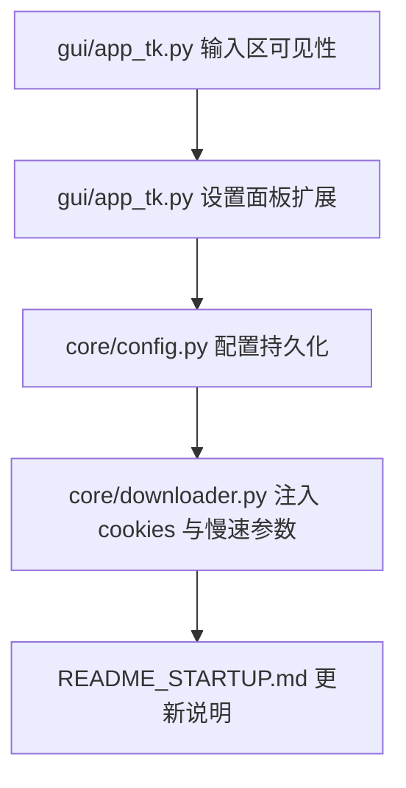

[模式：计划]

SEP 审计结果
- 维度 A (确定性): 9/10
- 维度 B (可见性): 9/10
最终状态：已通过审计，执行落盘。

架构逻辑图

符号执行蓝图 (SEP)

<planning_unit id="001">
<dependency>None</dependency>
<context>
F: @yt-dlp-gui/gui/app_tk.py -> Line 90-150 (class App._create_widgets, 输入区创建)
Anchor: "视频链接:" label creation + entry_url grid
</context>
<morphism>
[M]: LOCATE widget(Entry, id="entry_url") ->
     SET width(min_chars>=60) ->
     SET relief("solid") ->
     SET border(width>=1) ->
     SET background("white") ->
     ENSURE grid_columnconfigure(index=1, weight=1) ->
     ENSURE widget is not overlapped ->
     ENSURE top_frame background equals root background
</morphism>
<side_effects>
Impact: 输入区宽度与布局变化，可能影响顶栏按钮间距
</side_effects>
<stop_rule>
IF Entry widget not found THEN HALT | IF grid column weight for input column missing THEN HALT
</stop_rule>
<validation>
[V]: python -c "import tkinter as tk; print('tk_ok')"
[V]: rg "entry_url" yt-dlp-gui/gui/app_tk.py
</validation>
</planning_unit>

<planning_unit id="002">
<dependency>id: 001</dependency>
<context>
F: @yt-dlp-gui/gui/app_tk.py -> Line 30-90 (class SettingsDialog.__init__)
Anchor: "设置" 窗口创建 + 保存按钮
</context>
<morphism>
[M]: INSERT control(button, label="导入Cookie") ->
     INSERT control(button, label="清理Cookie") ->
     BIND on_click(import_cookie) ->
     BIND on_click(clear_cookie) ->
     ADD label to show current cookie path (single line, ellipsis if long)
</morphism>
<side_effects>
Impact: 设置窗口高度可能增加
</side_effects>
<stop_rule>
IF settings window lacks config reference THEN HALT | IF duplicate buttons exist THEN HALT
</stop_rule>
<validation>
[V]: rg "导入Cookie|清理Cookie" yt-dlp-gui/gui/app_tk.py
[V]: rg "SettingsDialog" yt-dlp-gui/gui/app_tk.py
</validation>
</planning_unit>

<planning_unit id="003">
<dependency>id: 002</dependency>
<context>
F: @yt-dlp-gui/core/config.py -> Line 1-34 (class Config)
Anchor: "self.data" default settings
</context>
<morphism>
[M]: EXTEND config defaults ->
     ADD key("cookies_path", default="") ->
     ADD key("safe_mode", default=true) ->
     ENSURE load/save persists new keys
</morphism>
<side_effects>
Impact: config.json schema changes
</side_effects>
<stop_rule>
IF json load fails and cannot save defaults THEN HALT
</stop_rule>
<validation>
[V]: rg "cookies_path" yt-dlp-gui/core/config.py
[V]: rg "safe_mode" yt-dlp-gui/core/config.py
</validation>
</planning_unit>

<planning_unit id="004">
<dependency>id: 003</dependency>
<context>
F: @yt-dlp-gui/core/downloader.py -> Line 22-55 (Downloader.start command build)
Anchor: cmd list construction
</context>
<morphism>
[M]: READ config.cookies_path ->
     IF non_empty THEN APPEND cmd("--cookies", cookies_path)
</morphism>
<side_effects>
Impact: 下载命令依赖 cookies 文件存在
</side_effects>
<stop_rule>
IF cookies_path set but file missing THEN HALT
</stop_rule>
<validation>
[V]: rg "--cookies" yt-dlp-gui/core/downloader.py
[V]: rg "cookies_path" yt-dlp-gui/core/downloader.py
</validation>
</planning_unit>

<planning_unit id="005">
<dependency>id: 003</dependency>
<context>
F: @yt-dlp-gui/core/downloader.py -> Line 22-55 (Downloader.start command build)
Anchor: cmd list construction
</context>
<morphism>
[M]: READ config.safe_mode ->
     IF true THEN APPEND cmd("--sleep-interval", "2") ->
                    APPEND cmd("--max-sleep-interval", "5") ->
                    APPEND cmd("--ratelimit", "5M")
</morphism>
<side_effects>
Impact: 下载速度降低，减少风控
</side_effects>
<stop_rule>
IF safe_mode is true and cmd already has rate-limit flags THEN HALT
</stop_rule>
<validation>
[V]: rg "sleep-interval|max-sleep-interval|ratelimit" yt-dlp-gui/core/downloader.py
[V]: rg "safe_mode" yt-dlp-gui/core/downloader.py
</validation>
</planning_unit>

<planning_unit id="006">
<dependency>id: 002</dependency>
<context>
F: @yt-dlp-gui/gui/app_tk.py -> Line 30-120 (class SettingsDialog)
Anchor: settings save handler
</context>
<morphism>
[M]: IMPLEMENT import_cookie ->
     OPEN file dialog ->
     VALIDATE file header startswith "# Netscape HTTP Cookie File" ->
     SET config.cookies_path ->
     UPDATE current path label
</morphism>
<side_effects>
Impact: 需要文件校验失败提示
</side_effects>
<stop_rule>
IF cookie file invalid THEN HALT
</stop_rule>
<validation>
[V]: rg "Netscape HTTP Cookie File" yt-dlp-gui/gui/app_tk.py
[V]: rg "cookies_path" yt-dlp-gui/gui/app_tk.py
</validation>
</planning_unit>

<planning_unit id="007">
<dependency>id: 002</dependency>
<context>
F: @yt-dlp-gui/gui/app_tk.py -> Line 30-120 (class SettingsDialog)
Anchor: settings save handler
</context>
<morphism>
[M]: IMPLEMENT clear_cookie ->
     SET config.cookies_path to empty ->
     UPDATE current path label ->
     OPTIONAL clear any error text
</morphism>
<side_effects>
Impact: 后续下载不带 cookies
</side_effects>
<stop_rule>
IF config reference missing THEN HALT
</stop_rule>
<validation>
[V]: rg "clear_cookie" yt-dlp-gui/gui/app_tk.py
[V]: rg "cookies_path" yt-dlp-gui/gui/app_tk.py
</validation>
</planning_unit>

<planning_unit id="008">
<dependency>id: 001</dependency>
<context>
F: @yt-dlp-gui/README_STARTUP.md -> Line 1-59 (启动指南)
Anchor: "快速启动" section
</context>
<morphism>
[M]: INSERT section("Cookie 使用") ->
     ADD steps(import cookies) ->
     ADD steps(clear cookies) ->
     ADD note(safe_mode default on) ->
     ENSURE markdown format
</morphism>
<side_effects>
Impact: 文档新增操作说明
</side_effects>
<stop_rule>
IF markdown anchor missing THEN HALT
</stop_rule>
<validation>
[V]: rg "Cookie 使用" yt-dlp-gui/README_STARTUP.md
[V]: rg "cookies" yt-dlp-gui/README_STARTUP.md
</validation>
</planning_unit>

低级模型兼容性自检
- Validation 可执行性检查：通过
- Context 定位精度检查：通过（含锚点与行号范围）
- Morphism 明确性检查：通过

是否确认落盘并进入执行环节？
