[模式：计划]

### 📜 SEP 审计结果

- **维度 A (确定性)**: 9/10
- **维度 B (可见性)**: 9/10
**最终状态：已通过审计，执行落盘。**

---

### 📊 架构逻辑图

```mermaid
graph TD
  S[入口校验: main.py GUI 选择逻辑] --> Q[保留 gui_qt/]
  S --> T[候选移除 gui/]
  S --> R[候选移除多余样例/临时文件]
  Q --> V[验证: 仍可启动 Qt GUI]
```

---

### 🏗️ 符号执行蓝图 (SEP)

@yt-dlp-gui/

<planning_unit id="001">
<dependency>None</dependency>
<context>
F: @yt-dlp-gui/main.py -> Line 20-50 (GUI backend selection)
</context>
<morphism>
[M]: READ backend_selection_logic -> ASSERT default_backend == "gui_qt" ->
     ASSERT no_legacy_gui_reference == true
</morphism>
<stop_rule>
IF backend_selection_logic missing THEN HALT.
</stop_rule>
<validation>
[V]: rg "gui_qt" yt-dlp-gui/main.py
[V]: rg "gui.app|gui.app_tk|gui/" yt-dlp-gui/main.py
</validation>
</planning_unit>

<planning_unit id="002">
<dependency>id: 001</dependency>
<context>
F: @yt-dlp-gui/gui_qt/ -> Directory existence
</context>
<morphism>
[M]: ASSERT dir_exists("yt-dlp-gui/gui_qt") ->
     ASSERT contains(["app_qt.py","settings_qt.py","models.py"])
</morphism>
<stop_rule>
IF any required file missing THEN HALT.
</stop_rule>
<validation>
[V]: test -d yt-dlp-gui/gui_qt && echo "gui_qt exists"
[V]: ls yt-dlp-gui/gui_qt | grep "app_qt.py"
</validation>
</planning_unit>

<planning_unit id="003">
<dependency>id: 002</dependency>
<context>
F: @yt-dlp-gui/gui/ -> Legacy GUI directory
</context>
<morphism>
[M]: MARK delete_candidate("yt-dlp-gui/gui/") ->
     REQUIRE confirm_delete_list == ["gui/app.py","gui/app_tk.py","gui/__init__.py"] ->
     REQUIRE backup_snapshot == true
</morphism>
<stop_rule>
IF any file in delete_candidate is referenced by main.py THEN HALT.
</stop_rule>
<validation>
[V]: rg "gui.app_tk|gui.app|gui/" yt-dlp-gui/main.py
[V]: rg "gui/" yt-dlp-gui -g "*.py"
</validation>
</planning_unit>

<planning_unit id="004">
<dependency>id: 002</dependency>
<context>
F: @yt-dlp-gui/gui_qt/ -> Non-code artifacts
</context>
<morphism>
[M]: MARK delete_candidate("yt-dlp-gui/gui_qt/cookies (2).txt") ->
     REQUIRE file_is_user_local_artifact == true
</morphism>
<stop_rule>
IF file is referenced in code or documentation THEN HALT.
</stop_rule>
<validation>
[V]: rg "cookies \\(2\\)\\.txt" yt-dlp-gui
[V]: test -f "yt-dlp-gui/gui_qt/cookies (2).txt" && echo "candidate exists"
</validation>
</planning_unit>

<planning_unit id="005">
<dependency>id: 003</dependency>
<context>
F: @yt-dlp-gui/gui/ -> Deletion phase
</context>
<morphism>
[M]: DELETE dir("yt-dlp-gui/gui/") ->
     ENSURE deletion_only_if "gui_qt" remains functional ->
     RECORD rollback_path == "backup_snapshot"
</morphism>
<side_effects>
Impact: Removes legacy Tk/CustomTk GUI code paths.
</side_effects>
<stop_rule>
IF fallback required in current environment THEN HALT.
</stop_rule>
<validation>
[V]: test ! -d yt-dlp-gui/gui && echo "gui removed"
[V]: rg "gui_qt" yt-dlp-gui/main.py
</validation>
</planning_unit>

<planning_unit id="006">
<dependency>id: 004</dependency>
<context>
F: @yt-dlp-gui/gui_qt/cookies (2).txt -> User artifact
</context>
<morphism>
[M]: DELETE file("yt-dlp-gui/gui_qt/cookies (2).txt") ->
     RECORD rollback_path == "backup_snapshot"
</morphism>
<stop_rule>
IF file is referenced by docs/config THEN HALT.
</stop_rule>
<validation>
[V]: test ! -f "yt-dlp-gui/gui_qt/cookies (2).txt" && echo "artifact removed"
</validation>
</planning_unit>

<planning_unit id="007">
<dependency>id: 005</dependency>
<context>
F: @yt-dlp-gui/README_STARTUP.md -> GUI说明
</context>
<morphism>
[M]: UPDATE doc_section("GUI backend") ->
     SET primary_backend="gui_qt" ->
     REMOVE mention_of_legacy_gui
</morphism>
<stop_rule>
IF README missing section THEN HALT.
</stop_rule>
<validation>
[V]: rg "gui_qt" yt-dlp-gui/README_STARTUP.md
[V]: rg "Tkinter|CustomTkinter|gui/" yt-dlp-gui/README_STARTUP.md
</validation>
</planning_unit>

<planning_unit id="008">
<dependency>id: 005</dependency>
<context>
F: @yt-dlp-gui/main.py -> GUI fallback logic
</context>
<morphism>
[M]: SIMPLIFY backend_selection ->
     REMOVE legacy imports ->
     ENSURE only gui_qt path remains
</morphism>
<stop_rule>
IF PySide6 missing and no fallback specified THEN HALT.
</stop_rule>
<validation>
[V]: rg "gui_qt" yt-dlp-gui/main.py
[V]: rg "gui.app|gui.app_tk|gui/" yt-dlp-gui/main.py
</validation>
</planning_unit>

<planning_unit id="009">
<dependency>id: 008</dependency>
<context>
F: @yt-dlp-gui/ -> Smoke validation
</context>
<morphism>
[M]: RUN import_check("gui_qt.app_qt") ->
     ASSERT no ImportError
</morphism>
<stop_rule>
IF ImportError THEN HALT.
</stop_rule>
<validation>
[V]: /Users/yelin/Desktop/codebase/yt-dlp/.venv/bin/python -c "from gui_qt.app_qt import AppWindow; print('OK')"
</validation>
</planning_unit>
