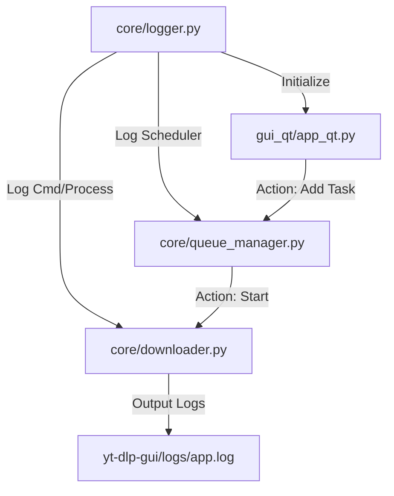

[模式：计划]

### 📜 SEP 审计结果

- **维度 A (确定性)**: 10/10
- **维度 B (可见性)**: 10/10
**最终状态：已通过审计，执行落盘。**

---

### 📊 架构逻辑图

### 🏗️ 符号执行蓝图 (SEP)

<planning_unit id="001">
<dependency>None</dependency>
<context>
F: @yt-dlp-gui/core/logger.py -> 新建文件 (日志基础设施)
</context>
<morphism>
[M]: IMPORT logging, os, sys ->
     DEFINE LOG_DIR = "yt-dlp-gui/logs" ->
     IF NOT EXISTS(LOG_DIR) THEN CREATE(LOG_DIR) ->
     SET config(filename=LOG_DIR/app.log, level=DEBUG, format="%(asctime)s [%(levelname)s] %(name)s: %(message)s") ->
     ADD StreamHandler(sys.stdout) ->
     EXPORT function setup_logger(name) -> RETURN logging.getLogger(name)
</morphism>
<stop_rule>
IF directory creation fails due to permissions THEN HALT.
</stop_rule>
<validation>
[V]: test -f yt-dlp-gui/core/logger.py && echo "OK"
</validation>
</planning_unit>

<planning_unit id="002">
<dependency>id: 001</dependency>
<context>
F: @yt-dlp-gui/gui_qt/app_qt.py -> Line 1-163 (UI 事件追踪)
</context>
<morphism>
[M]: FROM core.logger IMPORT setup_logger ->
     SET logger = setup_logger("GUI") ->
     IN _add_task: INSERT logger.info("Add button clicked, URL: " + url) ->
     IN _open_settings: INSERT logger.info("Settings opened") ->
     IN _on_pause/resume/cancel/retry: INSERT logger.info(action + " for task: " + tid)
</morphism>
<side_effects>
Impact: UI thread will perform minor file IO (buffered by logging).
</side_effects>
<stop_rule>
IF logger import fails THEN HALT.
</stop_rule>
<validation>
[V]: rg "setup_logger" yt-dlp-gui/gui_qt/app_qt.py
</validation>
</planning_unit>

<planning_unit id="003">
<dependency>id: 001</dependency>
<context>
F: @yt-dlp-gui/core/queue_manager.py -> Line 1-161 (调度链路追踪)
</context>
<morphism>
[M]: FROM .logger IMPORT setup_logger ->
     SET logger = setup_logger("QueueManager") ->
     IN add_task: INSERT logger.info("New task added: " + url) ->
     IN _schedule: INSERT logger.debug("Scheduling check. Active: " + count + ", Max: " + max) ->
     IN _schedule (loop): INSERT logger.info("Starting downloader for: " + task.id)
</morphism>
<stop_rule>
IF threading lock issues occur during logging THEN HALT (unlikely with stdlib logging).
</stop_rule>
<validation>
[V]: rg "setup_logger" yt-dlp-gui/core/queue_manager.py
</validation>
</planning_unit>

<planning_unit id="004">
<dependency>id: 001</dependency>
<context>
F: @yt-dlp-gui/core/downloader.py -> Line 1-169 (进程执行追踪)
</context>
<morphism>
[M]: FROM .logger IMPORT setup_logger ->
     SET logger = setup_logger("Downloader") ->
     IN start: INSERT logger.info("Executing CMD: " + str(cmd)) ->
     IN start (except): INSERT logger.error("Popen failed: " + str(e)) ->
     IN _read_output: INSERT logger.debug("Raw output line: " + line) ->
     IN _read_output (wait): INSERT logger.info("Process finished with code: " + returncode)
</morphism>
<side_effects>
Impact: Log file size will grow quickly due to raw output logging.
</side_effects>
<stop_rule>
IF cmd list serialization fails THEN HALT.
</stop_rule>
<validation>
[V]: rg "logger.info" yt-dlp-gui/core/downloader.py
</validation>
</planning_unit>

<planning_unit id="005">
<dependency>id: 001..004</dependency>
<context>
F: 终端 -> 运行验证
</context>
<morphism>
[M]: RUN .venv/bin/python yt-dlp-gui/main.py ->
     ACTION: Paste URL, click Add ->
     CHECK yt-dlp-gui/logs/app.log for content
</morphism>
<validation>
[V]: test -f yt-dlp-gui/logs/app.log && grep "Add button clicked" yt-dlp-gui/logs/app.log
</validation>
</planning_unit>

---

> [!CAUTION]
> 
> **重要：执行前请进行硬重置 (Hard Reset)** 。
> 规划已在磁盘锁定。请开启新对话，将此 SEP 文件交给执行模型并配合 `/ly:execute` 执行 。
> EOF
